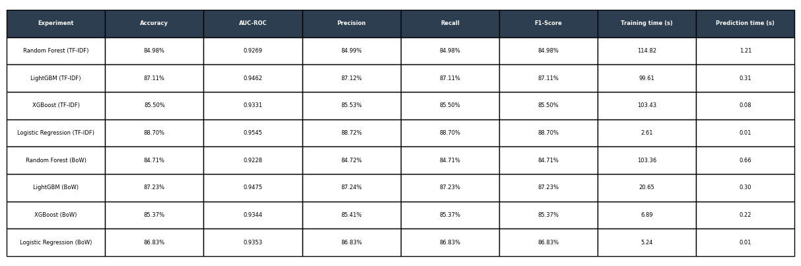

# Análise de Sentimentos em Reviews do IMDb

## Sobre o Projeto

Este projeto aplica técnicas de Processamento de Linguagem Natural (NLP) e Machine Learning para classificar automaticamente avaliações de filmes do IMDb como positivas ou negativas.

O estudo compara diferentes algoritmos de classificação e técnicas de vetorização textual, avaliando desempenho, qualidade das previsões e eficiência computacional.

---

## Objetivos

* Realizar o pré-processamento de textos.
* Transformar textos em representações numéricas.
* Comparar diferentes algoritmos de classificação.
* Avaliar métricas de desempenho.
* Analisar o impacto das técnicas de vetorização nos resultados.

---

## Dataset

O projeto utiliza o conjunto de dados IMDb Movie Reviews, composto por:

* 50.000 avaliações de filmes;
* Classes balanceadas;
* 25.000 avaliações positivas;
* 25.000 avaliações negativas;
* Ausência de valores nulos.

---

## Tecnologias Utilizadas

* Python
* Pandas
* Matplotlib
* Seaborn
* NLTK
* Scikit-Learn
* XGBoost
* LightGBM

---

## Pré-processamento dos Dados

As seguintes etapas foram aplicadas aos textos:

* Conversão para letras minúsculas;
* Remoção de tags HTML;
* Remoção de URLs;
* Remoção de caracteres especiais;
* Tokenização;
* Remoção de stopwords;
* Aplicação de stemming.

---

## Técnicas de Vetorização

### Bag of Words (BoW)

Representa os textos por meio da frequência das palavras, ignorando sua ordem.

### TF-IDF

Atribui maior peso às palavras mais relevantes e menos frequentes no conjunto de documentos.

---

## 🤖 Modelos Avaliados

* Logistic Regression
* Random Forest
* LightGBM
* XGBoost

Todos os modelos foram avaliados utilizando:

* TF-IDF
* Bag of Words (BoW)

---

## Métricas Utilizadas

* Accuracy
* Precision
* Recall
* F1-Score
* AUC-ROC
* Tempo de Treinamento
* Tempo de Predição


## Comparação dos Modelos



---

## 📄 Documentação

Uma documentação técnica completa está disponível em:

```text
docs/Relatorio_Analise_de_Sentimentos_IMDB.pdf
```

---

## Principais Conceitos Aplicados

* Processamento de Linguagem Natural (NLP)
* Limpeza e preparação de textos
* Vetorização textual
* Machine Learning supervisionado
* Avaliação de modelos
* Comparação de algoritmos
* Análise de sentimentos

---

## 👩‍💻 Autora

Laysa Cibele

Estudante de Ciência da Computação - Estagiária em Ciência de Dados

Junho, 2026.
